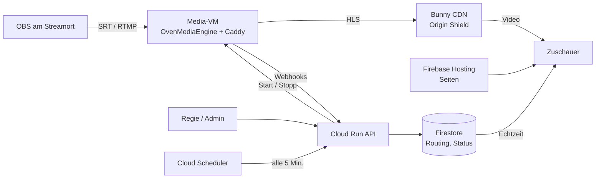

# Streaming-Plattform streaming.johannwiebe.de – Konzept

Stand: 2026-09-20

## Überblick und Entscheidungen

Die Plattform nimmt mehrere OBS-Streams gleichzeitig an und zeigt sie öffentlich auf festen Seiten unter streaming.johannwiebe.de. Sie startet in einem sparsamen Startprofil für wenige Zuschauer und wächst per Konfiguration auf 1.000, bei Großevents auf 10.000 gleichzeitige Zuschauer. Die Technik läuft bei Google, nur das Video verteilt Bunny CDN – das spart bei großen Zuschauerzahlen über 80 % der Kosten.

| Thema | Entscheidung |
| --- | --- |
| Ingest | OBS per SRT, RTMP als Fallback |
| Media-Server | OvenMediaEngine auf einer Compute-Engine-VM in Frankfurt, läuft nur zu Streamzeiten, Größe je Ausbaustufe |
| Format | klassisches HLS mit TS-Segmenten: 720p, 360p und Nur Ton, ab dem Normalprofil zusätzlich 480p |
| Auslieferung | Bunny CDN mit Origin Shield |
| Web-App | Firebase Hosting, API auf Cloud Run, Daten in Firestore |
| Zugang | öffentlich für jeden mit Link; Anmeldung nur für Admin, Regie und Streamer |
| Zurückspulen | 10 Minuten, solange der Stream läuft; keine Aufzeichnung |
| Streamzeiten | Mittwochabend, Samstagabend, Sonntagmorgen; sonst heruntergefahren |
| Kosten | Startprofil ca. 15–55 $ im Monat bei bis zu 100 Zuschauern; bei 500–1.000 Zuschauern ca. 175–340 $ |

## Architektur

OBS sendet an eine VM, die daraus HLS macht; Bunny verteilt das Video, Firebase liefert Seiten und Routing. Zuschauer berühren nur Seiten, CDN und Firestore – nie die API oder die VM direkt. Dadurch skaliert alles, was Zuschauer abrufen, von selbst.



Das Signal läuft von OBS über VM und Bunny zum Zuschauer; API und Scheduler steuern, welcher Eingang wo läuft und wann die VM an ist.

| Komponente | Dienst | Aufgabe | Läuft |
| --- | --- | --- | --- |
| Media-Server | OvenMediaEngine in Docker auf Compute Engine, europe-west3 | Ingest, Key-Prüfung per Webhook, Transcoding, HLS, 10 Min. Zurückspulen | nur zu Streamzeiten |
| Origin-Proxy | Caddy auf derselben VM | TLS, Cache-Header, lässt nur Bunny durch | mit der VM |
| CDN | Bunny Pull Zone mit Origin Shield | Video an alle Zuschauer | immer, Kosten nur bei Traffic |
| Web-App | React + TypeScript auf Firebase Hosting | Ausgangsseiten, Einbettung, Admin- und Regieansicht | immer, statisch |
| API | Cloud Run, TypeScript | Webhooks, Zeitplan, VM-Steuerung, Keys, Einladungen | skaliert auf null |
| Daten | Firestore, europe-west3 | Eingänge, Ausgänge, Routing, Zeitplan, Status | immer |
| Anmeldung | Firebase Authentication | Admin, Regie, Streamer | immer |
| Taktgeber | Cloud Scheduler, ein Job | prüft alle 5 Minuten den Zeitplan | immer |
| Infrastruktur | Terraform bzw. OpenTofu | alles reproduzierbar als Code | – |

## Ausbaustufen

Die Plattform startet im Startprofil und wächst per Konfiguration, ohne Umbau. Die Zuschauerzahl belastet die VM kaum, weil nur Bunny bei ihr abholt. Gewechselt wird deshalb wegen mehr gleichzeitiger Eingänge oder höherer Ansprüche an Qualität und Ausfallsicherheit.

| Merkmal | Startprofil | Normalprofil | Großevent |
| --- | --- | --- | --- |
| Gedacht für | die erste Zeit, bis ca. 100 Zuschauer | bis ca. 1.000 Zuschauer | bis ca. 10.000 Zuschauer |
| Eingänge gleichzeitig | 1–2 | bis 3 | bis 3 |
| VM | z. B. e2-standard-2 für einen, e2-standard-4 für zwei Eingänge (im Durchstich messen) | 8 vCPU, z. B. c3-standard-8 | wie Normalprofil |
| Qualitätsstufen | 720p, 360p, Sparstufe | 720p, 480p, 360p, Sparstufe | wie Normalprofil |
| IP der VM | wechselnd, per Cloudflare-API eingetragen | fest | fest |

Maschinentyp, Qualitätsprofil und IP-Art sind Variablen; ein Wechsel dauert an einem Nicht-Streamtag etwa zehn Minuten. Anlass für das Normalprofil: Die VM-CPU liegt im Termin über 70 %, ein dritter Eingang kommt dazu, oder regelmäßig schauen mehrere hundert Menschen zu. Was jedes Profil kostet, steht unter Kosten.

## Eingänge und Stream-Accounts

Jeder Eingang ist ein Stream-Account mit eigenem geheimen Key. Beim Verbindungsaufbau fragt OvenMediaEngine per Webhook bei der API nach, ob der Key gilt, und bildet den Stream auf die Eingangs-ID ab. So steht der Key nie in einer öffentlichen Adresse.

- Der Admin legt Eingänge an, sieht und rotiert Keys; ein rotierter Key gilt sofort nicht mehr.
- Streamer sehen nur ihre eigenen Eingänge und kopieren die fertigen OBS-Einstellungen per Knopf.
- Verbindet oder trennt sich OBS, meldet OME das an die API; der Status live/offline steht nach wenigen Sekunden in allen Ansichten.

### OBS-Einstellungen

| Einstellung | Wert |
| --- | --- |
| Protokoll | SRT, RTMP als Fallback |
| SRT-Ziel | srt://ingest.streaming.johannwiebe.de:9999 mit streamid, fertig aus dem Adminbereich kopieren |
| RTMP-Ziel | rtmp://ingest.streaming.johannwiebe.de:1935/app, Key aus dem Adminbereich |
| Video | H.264, CBR 3.000 kbit/s, 1280×720, 30 fps, Keyframe alle 2 s |
| Audio | AAC, 48 kHz, 128 kbit/s |
| SRT-Latenz | ca. 2 s |
| Wiederverbinden | automatisch aktiviert |
| Upload am Streamort | mindestens 6 Mbit/s stabil je Eingang |

### Qualitätsstufen

Im Normalprofil rechnet die VM jeden Eingang in vier Stufen um. Ausgeliefert wird klassisches HLS mit TS-Segmenten von 4 Sekunden, die Verzögerung liegt bei etwa 15–25 Sekunden ([OME-Doku zu HLS](https://ovenmedia.com/docs/ome/streaming/hls)).

| Stufe | Auflösung | Video | Herkunft |
| --- | --- | --- | --- |
| Hoch | 1280×720 | ca. 3.000 kbit/s | OBS-Signal unverändert |
| Mittel | 854×480 | ca. 1.200 kbit/s | neu kodiert |
| Niedrig | 640×360 | ca. 600 kbit/s | neu kodiert |
| Spar / Nur Ton | 256×144 | ca. 100 kbit/s | neu kodiert |

Der Ton (AAC 128 kbit/s) läuft in allen Stufen unverändert mit. OMEs TS-HLS erlaubt nur Bild und Ton gemeinsam, deshalb spielt der Nur-Ton-Modus die Sparstufe mit ausgeblendetem Bild. 1080p wäre möglich, verdoppelt aber ungefähr die Auslieferungskosten.

Im Startprofil entfällt die 480p-Stufe. Das spart etwa die Hälfte der Rechenleistung fürs Umrechnen und erlaubt eine deutlich kleinere VM; Zuschauer mit mittlerer Leitung bekommen dann 360p statt 480p.

## Ausgänge und Routing

Ausgänge sind feste Seiten, deren Adresse sich nach dem Anlegen nie ändert. Welcher Eingang dort läuft, bestimmt das Routing in Firestore. Umgeschaltet wird per Preset mit einem Tipp, auch vom Handy.

| Preset (Beispiel) | /ausgang-a | /ausgang-b | /ausgang-c |
| --- | --- | --- | --- |
| Normal | Eingang 1 | Eingang 2 | Eingang 3 |
| Alle auf Eingang 1 | Eingang 1 | Eingang 1 | Eingang 1 |

- Adressen: streaming.johannwiebe.de/\<name> und zum Einbetten /embed/\<name>; reserviert sind admin, api und embed.
- Neben Presets gibt es Einzel-Overrides je Ausgang; ein Termin im Zeitplan kann ein Preset automatisch setzen.
- Die Seite hört nur auf ihr öffentliches Status-Dokument und tauscht beim Umschalten die Quelle im selben Video-Element. Nach 2–3 Sekunden läuft der neue Eingang.
- Ohne Signal zeigt sie den nächsten Termin und startet von selbst, sobald der Eingang live geht.
- Jeder Eingang wird genau einmal umgerechnet, egal auf wie vielen Ausgängen er läuft; Eingänge ohne Signal belasten die VM nicht.

Feste Stream-Adressen für externe Player wie VLC sind optional. Die API leitet sie auf den aktuellen Eingang weiter, ein Umschalten greift dort aber erst nach Neustart des Players.

## Player und Handy

Der Player spielt überall dasselbe HLS und nutzt auf dem iPhone den nativen Vollbildmodus des Video-Elements. Auf dem iPhone lässt sich Vollbild nur für Video-Elemente auslösen, nicht für andere Seitenelemente ([WebKit-Bug 212934](https://bugs.webkit.org/show_bug.cgi?id=212934)). Daran scheitert AVideo vermutlich.

- Player: Video.js in der aktuellen stabilen Version, mit Live-Oberfläche fürs Zurückspulen, playsinline und Rückfall auf natives Vollbild.
- Große Bedienelemente; Autostart stumm mit gut sichtbarem „Ton an“, weil Browser Autoplay mit Ton in der Regel blockieren.
- Knöpfe für Nur Ton, AirPlay und Chromecast; Web-App-Manifest fürs Icon auf dem Homebildschirm.
- Admin- und Regieansicht sind ebenfalls fürs Handy gebaut.

### 10 Minuten zurückspulen

OME hält dafür die Segmente der letzten 10 Minuten auf der Festplatte der VM vor ([OME-Doku, Live Rewind](https://ovenmedia.com/docs/ome/streaming/hls)). Der Player zeigt eine Zeitleiste und einen „Live“-Knopf; endet der Stream, ist der Puffer weg. Beim Umschalten des Routings springt der Player auf den Live-Punkt des neuen Eingangs.

Einschränkung laut OME-Doku: Safaris nativer Player zeigt die Zeitleiste nur bei Playlists vom Typ EVENT, und die wachsen ab Streamstart. Beim gleitenden 10-Minuten-Fenster fehlt das Zurückspulen deshalb vermutlich im iPhone-Vollbild; im normalen Modus geht es über die eigenen Player-Knöpfe. Alternative: eine EVENT-Playlist über den ganzen Termin, dann geht es überall bis zum Anfang zurück, bei größeren Playlists.

### Testgeräte

| Gerät | Prüfen |
| --- | --- |
| Windows: Chrome, Edge, Firefox | Start, Qualitätswechsel, Vollbild, Zurückspulen |
| Android: Chrome | zusätzlich Nur Ton bei gesperrtem Bildschirm, Chromecast |
| iPhone und iPad: Safari | natives Vollbild, Umschalten im Vollbild, Zurückspulen, Nur Ton bei gesperrtem Bildschirm, AirPlay |
| Mac: Safari | Start, Vollbild, AirPlay |

## Nutzer und Rollen

Zuschauer brauchen kein Konto; angemeldet werden nur Admin, Regie und Streamer. Die Anmeldung läuft über Firebase Authentication, passwortlos per E-Mail-Link oder mit Google-Konto.

| Rolle | Darf |
| --- | --- |
| Admin | alles: Nutzer einladen, Eingänge und Keys, Ausgänge, Presets, Zeitplan |
| Regie | Presets und Routing schalten, Status aller Eingänge sehen, Server außerplanmäßig starten |
| Streamer | eigene Eingänge: OBS-Daten, Vorschau, Status; Server starten |
| Zuschauer | alle Ausgangsseiten ansehen, ohne Anmeldung |

Rolle und zugewiesene Eingänge hängen als Custom Claims am Konto; neue Leute lädt der Admin per E-Mail ein. Geprüft wird serverseitig, in den Firestore-Regeln und in der API.

## Datenmodell in Firestore

Firestore hält Konfiguration und Live-Status; öffentlich lesbar ist nur ein vorberechnetes Dokument je Ausgang. Geschrieben wird immer über die API, damit sie dieses Dokument sofort mitzieht. Die Player hören nur darauf.

| Collection | Inhalt | Lesen | Ändern (über die API) |
| --- | --- | --- | --- |
| public/{name} | effektiver Eingang, HLS-Adresse, Status, nächster Termin | alle | nur API selbst |
| inputs | Name, Status live/offline, letzte Verbindung, zugewiesene Streamer | angemeldet | Admin |
| inputSecrets | Stream-Key je Eingang | nur über die API | Admin (Rotation) |
| outputs | Name in der Adresse, Titel, Standard-Eingang | angemeldet | Admin |
| presets | Name, Zuordnung Ausgang → Eingang | angemeldet | Admin |
| routing/current | aktives Preset, Einzel-Overrides, geändert von und um | angemeldet | Admin, Regie |
| schedule | Wochentermine in Europe/Berlin, Vorlauf, optionales Preset | angemeldet | Admin |
| infra/state | VM-Zustand, bereit seit, wach gehalten bis | angemeldet | nur API selbst |
| users | Anzeigename, Rolle als Spiegel der Claims | Admin | Admin |

## Zeitplan und Automatik

Die VM läuft nur rund um die Termine. Ein Scheduler-Job ruft alle 5 Minuten die API auf, die nach Zeitplan und tatsächlicher Nutzung startet und stoppt. An den übrigen Tagen laufen nur die statischen Seiten, Firestore und die Disk der gestoppten VM.

| Regel | Wert |
| --- | --- |
| Start | 45 Minuten vor Terminbeginn |
| Bereit-Meldung | VM meldet sich nach dem Booten signiert bei der API |
| Alarm | wenn 15 Minuten vor Beginn nicht bereit |
| Stopp | nach Terminende, wenn 20 Minuten lang kein Eingang sendet |
| Nie stoppen | solange ein Eingang live ist |
| Sondertermin | „Jetzt hochfahren“ hält die VM 3 Stunden wach, danach gilt die 20-Minuten-Regel |
| Sicherheitsnetz | Stopp nach 8 Stunden ohne Signal |

Die genauen Uhrzeiten für Mittwochabend, Samstagabend und Sonntagmorgen pflegt der Admin in der Oberfläche; Sommer- und Winterzeit regelt Europe/Berlin automatisch. Auf der VM starten OvenMediaEngine und Caddy per Docker Compose von selbst, die Zertifikate liegen auf der Disk. Keine Spot-VM: Google darf sie jederzeit abschalten, auch mitten im Termin.

## Domains und DNS

Alle Einträge liegen bei Cloudflare und stehen auf „DNS only“. Über den Cloudflare-Proxy kämen weder SRT noch die Zertifikate von Firebase und Bunny sauber durch.

| Name | Typ | Ziel | Zweck |
| --- | --- | --- | --- |
| streaming.johannwiebe.de | A/TXT laut Firebase | Firebase Hosting | Seiten, Admin, /api |
| live.streaming.johannwiebe.de | CNAME | Bunny Pull Zone | Video für Zuschauer |
| origin.streaming.johannwiebe.de | A | IP der VM | nur Bunny holt hier ab |
| ingest.streaming.johannwiebe.de | A | IP der VM | Ziel für OBS |

Im Startprofil hat die VM eine wechselnde IP und trägt sie beim Booten per Cloudflare-API selbst in origin und ingest ein, mit 60 Sekunden TTL. Das spart ca. 7 $ im Monat; ab dem Normalprofil kommt eine feste IP dazu, damit Bunny und OBS nie auf DNS-Umstellungen warten. Der Cloudflare-Token darf nur DNS-Einträge dieser Zone ändern und liegt in Secret Manager.

/api leitet Firebase Hosting per Rewrite an Cloud Run weiter; ob das mit Cloud Run in europe-west3 geht, prüft Phase 2, sonst läuft die API in europe-west1.

## Sicherheit, Datenschutz und Betrieb

Geschützt werden vor allem die Stream-Keys, die VM und das Budget. Zuschauer brauchen kein Konto, und die Seiten laufen ohne Tracker.

| Bereich | Maßnahme |
| --- | --- |
| Stream-Keys | 32 zufällige Zeichen, nur über die API sichtbar, Rotation per Klick |
| Webhooks | OME-Anfragen an die API sind signiert, die API prüft die Signatur |
| VM | offen nur UDP 9999 (SRT), TCP 1935 (RTMP) und HTTPS; Caddy lässt nur Anfragen mit geheimem Bunny-Header durch; SSH nur über IAP |
| API | Admin-Endpunkte mit Firebase-ID-Token und Rolle, Scheduler mit OIDC-Token; das Dienstkonto darf nur diese eine VM starten und stoppen |
| Firestore | öffentlich lesbar nur public/\* |
| Updates | Versionen von OME und Caddy fest angeben, Updates an einem Nicht-Streamtag testen |

- Alarme per E-Mail oder Google-Cloud-App: VM 15 Minuten vor Beginn nicht bereit, Eingang bricht während eines Termins ab.
- Budget: Google-Budgetalarme bei 50, 80 und 100 %; bei Bunny automatische Aufladung und ein Bandbreitenlimit weit über dem Großevent als Notbremse.
- Datenschutz: Impressum und Datenschutzerklärung mit Google und Bunny als Auftragsverarbeitern; AV-Verträge in beiden Konsolen akzeptieren.
- Da jeder zuschauen kann: Hinweis am Eingang, Kamera möglichst nach vorne statt ins Publikum.

## Kosten

Im Startprofil kostet die Plattform rund 15–55 $ im Monat, bei 500–1.000 Zuschauern im Schnitt rund 175–340 $. Ein Großevent mit 10.000 Zuschauern kommt mit gut 200 $ dazu. Ganz ohne Streams bleiben im Startprofil etwa 4 $ für die Disk der gestoppten VM und die Bunny-Mindestgebühr von 1 $.

| Grundkosten pro Monat, USD | Startprofil | Normalprofil |
| --- | --- | --- |
| VM, ca. 40 Std. Laufzeit (Richtwert) | 4–8 | 15–25 |
| Disk und IP (Richtwert) | ca. 3, wechselnde IP | ca. 10, feste IP |
| Traffic VM → Bunny über Origin Shield (Richtwert) | 2–10 | 10–20 |
| Firebase Hosting, Cloud Run, Firestore, Auth, Scheduler | 0–2 | 0–5 |
| Summe | ca. 10–25 | ca. 35–60 |

Dazu kommt die Auslieferung: pro Zuschauer im Schnitt rund 0,28 $ im Monat im Standard-Netz, 0,14 $ im Volume-Netz.

| Zuschauer im Schnitt | Profil | Auslieferung, USD | Gesamt pro Monat, USD |
| --- | --- | --- | --- |
| 10 | Start | ca. 3 | ca. 13–28 |
| 30 | Start | ca. 8 | ca. 18–33 |
| 100 | Start | ca. 28 | ca. 38–53 |
| 500 | Normal | ca. 140 | ca. 175–200 |
| 1.000 | Normal | ca. 280 | ca. 315–340 |
| Großevent: 10.000 für 2 Std. | Normal | ca. 215 zusätzlich | – |

Annahmen: 13 Termine im Monat mit je 2 Stunden live, höchstens 720p, rund 1 GiB pro Zuschauerstunde; „im Schnitt“ meint den Durchschnitt über die Livezeit. Bunny kostet im Standard-Netz (119 Standorte) 0,01 $ pro GB in Europa, im Volume-Netz (10 Standorte) 0,005 $, ohne Gebühren pro Anfrage ([Bunny-Preise](https://bunny.net/pricing/cdn/)). Die VM-Werte sind Richtwerte ohne Preisquelle und werden im Durchstich bestätigt.

Zum Vergleich: Mit Cloud CDN läge allein die Auslieferung bei ca. 1.000–1.700 $ im Monat, bei 0,08 $ pro GiB bis 10 TiB und 0,055 $ darüber ([Cloud-CDN-Preise](https://cloud.google.com/cdn/pricing)). Googles Managed-Transcoder Live Stream API kostet in Europa zusätzlich rund 1–1,60 $ pro Eingang und Stunde ([Live-Stream-API-Preise](https://cloud.google.com/products/livestream/pricing)).

Auch im Startprofil bleibt Bunny vorn: Cloud CDN bräuchte zusätzlich einen dauerhaft berechneten Load Balancer, Bunny nur 1 $ Mindestgebühr.

Hebel: im Startprofil bleiben, solange es reicht, 720p als Obergrenze beibehalten, das Volume-Netz testen und den Nur-Ton-Modus sichtbar anbieten.

## Umsetzung mit Claude Code

Gebaut wird in fünf Phasen, jede für sich testbar; zu jeder gehört ein Prompt für Claude Code. Vorab von Hand: GCP-Projekt mit Abrechnung und Budgetalarm, Firebase zum Projekt hinzufügen, Bunny-Konto mit automatischer Aufladung, Git-Repo anlegen. Dieses Doc als Markdown exportieren und als docs/konzept.md ins Repo legen, die Prompts beziehen sich darauf.

| Phase | Inhalt | Fertig, wenn |
| --- | --- | --- |
| 1 Durchstich | VM mit OME und Caddy, ein Test-Eingang, Bunny, Testseite | läuft auf allen Testgeräten inkl. iPhone-Vollbild und Zurückspulen |
| 2 Ausgänge und Routing | Web-App, feste Seiten, Presets, Regieansicht | Umschalten wirkt auf allen offenen Seiten in unter 5 s |
| 3 Konten und Stream-Accounts | Anmeldung, Rollen, Keys, Webhooks, OBS-Daten | falscher Key wird abgewiesen, Status stimmt |
| 4 Automatik und Betrieb | Zeitplan, Start und Stopp, Alarme, Lasttest | eine Testwoche läuft ohne Eingreifen |
| 5 Umstieg | Parallelbetrieb mit AVideo, Anleitungen, Umstellung | ein Termin läuft ohne Probleme auf der neuen Plattform |

### Prompt für Phase 1

```text
Lies docs/konzept.md, vor allem Architektur, Eingänge, Player sowie Domains und DNS. Wir bauen Phase 1: den Durchstich der Media-Pipeline. Lege zuerst eine CLAUDE.md mit Projektkontext an, stelle dann einen Plan vor und setze ihn nach meiner Freigabe um.

Ziel: Ein OBS-Stream kommt per SRT an und ist über Bunny CDN als HLS in mehreren Stufen mit 10 Minuten Zurückspulen abspielbar.

1. infra/ (Terraform/OpenTofu, State in einem GCS-Bucket): VM in europe-west3, Maschinentyp als Variable (Start: e2-standard-4, später c3-standard-8), Debian 12, keine Spot-VM; IP-Art als Variable: wechselnd (die VM trägt ihre IP beim Booten per Cloudflare-API in origin und ingest ein, Token aus Secret Manager) oder fest; Firewall für UDP 9999, TCP 1935, TCP 80 und 443; SSH nur über IAP; eigenes Dienstkonto mit minimalen Rechten.
2. vm/: Docker Compose mit OvenMediaEngine und Caddy, Versionen fest gepinnt, Neustart bei Absturz, Start beim Booten.
3. OME: Ingest per SRT und RTMP; Qualitätsprofil als Variable (Start: 720p Bypass, 360p und 144p neu kodiert; Normal: zusätzlich 480p), Ton AAC 128 kbit/s für alle Stufen; klassisches HLS mit TS-Segmenten, 4 s; DVR mit 10 Minuten. Prüfe die Einheit von MaxDuration (die Doku widerspricht sich) und ob Safaris nativer Player beim gleitenden Fenster eine Zeitleiste zeigt.
4. Caddy vor OME: TLS für origin.streaming.johannwiebe.de; Cache-Control für Playlists höchstens 2 s, für Segmente 1 h; CORS für https://streaming.johannwiebe.de; Anfragen ohne geheimen Header X-Origin-Auth mit 403 abweisen.
5. Bunny Pull Zone (per Terraform, falls ein gepflegter Provider existiert, sonst als Schritt-für-Schritt-Anleitung): Origin, Origin Shield, Hostname live.streaming.johannwiebe.de mit Zertifikat, geheimer Header zum Origin, Cache nach Origin-Headern, CORS.
6. Eine schlichte Testseite mit Video.js (Live-Oberfläche, playsinline, natives Vollbild auf dem iPhone) auf Firebase Hosting.

Vorerst ein fester Test-Key, noch keine Webhooks. Schreibe eine README mit allen manuellen Schritten, inkl. der DNS-Einträge bei Cloudflare als „DNS only“.
Fertig, wenn der Stream in Chrome, Edge, Firefox, Android-Chrome und Safari auf iPhone und iPad mit Vollbild, Qualitätswechsel und Zurückspulen läuft, die Verzögerung unter 25 s liegt und die VM-CPU im Startprofil bei zwei gleichzeitigen Test-Streams unter 70 % bleibt.
```

### Prompt für Phase 2

```text
Lies docs/konzept.md, vor allem Ausgänge und Routing, Player und Handy sowie Datenmodell. Wir bauen Phase 2: die Web-App mit festen Ausgangsseiten und Routing. Erst Plan, dann Umsetzung nach Freigabe.

Stack: React, TypeScript und Vite auf Firebase Hosting; API mit TypeScript auf Cloud Run, per Hosting-Rewrite unter /api (prüfe, ob der Rewrite mit europe-west3 geht, sonst europe-west1); Firestore in europe-west3.

1. Datenmodell laut Konzept: inputs, outputs, presets, routing/current, public/{name}.
2. Die API ändert Routing, Presets und Ausgänge und berechnet dabei public/{name} neu.
3. Ausgangsseite /{name} und /embed/{name}: hört nur auf public/{name}, tauscht beim Umschalten die Quelle im selben Video-Element, zeigt ohne Signal den nächsten Termin und startet automatisch, sobald der Eingang live ist. Dazu große Bedienelemente, stummer Autostart mit „Ton an“, Nur-Ton-Modus (Sparstufe, Bild ausgeblendet), AirPlay, Chromecast, Web-App-Manifest.
4. Regieansicht /admin/regie, zuerst fürs Handy: Presets per Tipp, Einzel-Overrides, Live-Status je Eingang. Vorerst nur für eine Admin-Anmeldung.
5. Firestore-Regeln: öffentlich lesbar nur public/*, alles andere nur angemeldet.

Namen von Ausgängen sind nach dem Anlegen unveränderlich; reserviert sind admin, api und embed.
Fertig, wenn ein Preset auf allen offenen Seiten in unter 5 s wirkt, auch auf einem iPhone im Vollbild. Verlässt iOS dabei das Vollbild, dokumentiere es und fange es bestmöglich ab.
```

### Prompt für Phase 3

```text
Lies docs/konzept.md, vor allem Eingänge und Stream-Accounts, Nutzer und Rollen sowie Sicherheit. Wir bauen Phase 3: Konten, Rollen und Stream-Accounts. Erst Plan, dann Umsetzung nach Freigabe.

1. Firebase Authentication mit E-Mail-Link und Google-Login; Rollen admin, regie und streamer plus zugewiesene Eingänge als Custom Claims; Einladung per E-Mail durch den Admin.
2. Stream-Keys mit 32 zufälligen Zeichen in inputSecrets, ohne Client-Zugriff; Anzeige und Rotation nur über die API für Admin und zugewiesene Streamer.
3. OME AdmissionWebhooks an die API mit Signaturprüfung: Key prüfen, Stream auf die Eingangs-ID abbilden, sodass der Key nie im HLS-Pfad steht; Status live/offline in inputs setzen. Prüfe in der OME-Doku, dass die Webhooks für SRT und RTMP greifen.
4. Streamer-Ansicht: fertige OBS-Einstellungen für SRT (inkl. URL-kodierter streamid) und RTMP zum Kopieren, Vorschau-Player, Status.
5. Admin-Ansicht: Nutzer, Eingänge, Ausgänge und Presets verwalten.
6. Firestore-Regeln und API-Prüfungen für alle Rollen, mit Tests im Firestore-Emulator.

Fertig, wenn ein falscher oder rotierter Key abgewiesen wird, der richtige Key live geht, der Status in unter 5 s stimmt und jede Rolle nur sieht, was sie darf.
```

### Prompt für Phase 4

```text
Lies docs/konzept.md, vor allem Zeitplan und Automatik, Sicherheit und Kosten. Wir bauen Phase 4: Automatik und Betrieb. Erst Plan, dann Umsetzung nach Freigabe.

1. Zeitplan-Verwaltung in der Admin-Ansicht: Wochentermine in Europe/Berlin, Vorlauf, optionales Preset.
2. Cloud Scheduler: ein Job alle 5 Minuten auf /api/tick, abgesichert per OIDC-Token.
3. Tick-Logik: VM 45 Minuten vor einem Termin starten; nach Terminende stoppen, wenn 20 Minuten kein Eingang sendet; nie stoppen, solange ein Eingang live ist; „Jetzt hochfahren“ hält 3 Stunden wach; Sicherheitsnetz nach 8 Stunden ohne Signal.
4. Die VM meldet sich nach dem Booten signiert als bereit, sobald OME läuft und die DNS-Einträge auf ihre IP zeigen; Zustand in infra/state, sichtbar in allen Ansichten.
5. Alarme über Cloud Monitoring per E-Mail und App: nicht bereit 15 Minuten vor Beginn, Eingang bricht während eines Termins ab. Budgetalarme bei 50, 80 und 100 %.
6. Das API-Dienstkonto darf nur diese eine VM starten und stoppen.
7. Ein Lasttest-Skript mit einigen hundert simulierten HLS-Zuschauern gegen Bunny, das die Last auf der VM mitprotokolliert.

Fertig, wenn eine Testwoche ohne manuelles Eingreifen läuft und die VM-Last im Lasttest unabhängig von der Zuschauerzahl bleibt.
```

### Prompt für Phase 5

Phase 5 ist vor allem Organisation: OBS sendet per Multi-Output-Plugin zusätzlich an AVideo, die neuen festen Links werden verteilt, und nach einem problemlosen Termin wird AVideo abgeschaltet. Claude Code schreibt dafür die Anleitungen.

```text
Lies docs/konzept.md. Schreibe für den Umstieg von AVideo zwei Kurzanleitungen als Markdown in docs/: eine für Streamer (OBS einrichten, SRT und RTMP, Parallelbetrieb mit AVideo per Multi-Output-Plugin, was tun bei Abbruch) und eine für die Regie (Presets schalten, Sondertermin starten, Alarme verstehen). Einfache Sprache, Schritt für Schritt, je höchstens zwei Seiten.
```

## Annahmen und offene Punkte

Diese Punkte sind angenommen und sollten vor Phase 2 bestätigt werden.

- [ ] Anfangs ein bis zwei Eingänge gleichzeitig (Startprofil), später bis zu drei; das bestimmt die VM-Größe.
- [ ] Genaue Uhrzeiten der Termine am Mittwoch, Samstag und Sonntag.
- [ ] Namen der Ausgänge für die festen Adressen, z. B. /hauptsaal.
- [ ] 720p reicht als höchste Qualität.
- [ ] Am Streamort gibt es mindestens 6 Mbit/s stabilen Upload je Eingang.
- [ ] Zurückspulen: gleitende 10 Minuten oder ab Terminbeginn (siehe Player und Handy).
- [ ] Zuschauerzahlen als Statistik gewünscht? Bisher nicht eingeplant.
